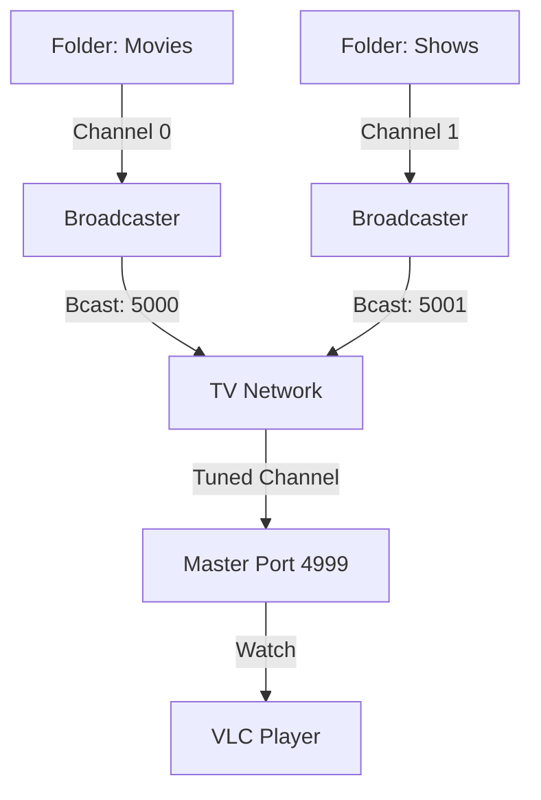

# GoCable (Polypheides Edition) 📺

A high-performance Go application for playing media in your homelab the way a television station would. Set up multiple "virtual channels" that continuously broadcast media to your network.

---

## 📺 How it Works
Think of GoCable like a physical TV rack. You point it at folders (channels), and it broadcasts them 24/7. Use the "Live Window" or "Master Stream" to watch what's currently tuned.



---

## 🚀 Key Features

- **Multi-Channel Architecture**: Each folder you add becomes an independent channel with its own dedicated broadcast relay.
- **TCP & UDP Support**: Choose between standard UDP or robust TCP streaming for a rock-solid viewing experience.
- **Master Stream (Port 4999)**: A central hub port that automatically switches its broadcast to whichever channel you are currently "tuned" into.
- **TCP Fan-out Relayer**: Custom Go-side server allows **multiple simultaneous clients** to connect to the same TCP stream.
- **Premium Web Dashboard**: A modern, HTMX-powered interface featuring "metal" tactile controls and real-time "LCD" track updates with smooth DOM morphing.
- **Developer-Friendly Logging**: Action-oriented server logs that show exactly what's playing on each channel without the background noise.
- **Recursive Discovery**: Automatically find media in nested subfolders (e.g., `Season 1/`, `S02/`).

---

## 🎞️ Media Recommendations
For the best experience (and smoothest transitions):
- **Format**: `.mkv` or `.mp4`
- **Codec**: **H.265 / HEVC** is highly recommended.
- **Why?**: GoCable is specifically tuned with synchronization flags optimized for HEVC streams to ensure professional, "glitch-free" switching between files.

---

## 🛠️ Dependencies

Follow these steps exactly to get everything ready:

### 1. Install FFmpeg (The Engine)
- **Windows**: 
  1. Download the "essentials" zip from [gyan.dev](https://www.gyan.dev/ffmpeg/builds/).
  2. Extract it to `C:\ffmpeg`.
  3. Search for "Edit the system environment variables" in Windows.
  4. Click **Environment Variables** > **Path** > **Edit** > **New**.
  5. Paste `C:\ffmpeg\bin` and click OK.
- **Linux**: Run `sudo apt update && sudo apt install ffmpeg`.

### 2. Install VLC (The Screen)
- Download and install normally from [videolan.org](https://www.videolan.org/vlc/).
- **Linux Users**: If you want the server to open a window, also run `sudo apt install vlc libvlc-dev`.

### 3. Install Go (The Compiler)
- Download from [go.dev](https://go.dev/dl/).

<details>
<summary><b>Step-by-Step Go Installation Guide</b></summary>

#### 🐧 Linux
1. **Cleanup**: Remove any previous installation:
   `sudo rm -rf /usr/local/go`
2. **Extract**: Unpack the archive into `/usr/local` (replace with your version filename):
   `sudo tar -C /usr/local -xzf go1.XX.X.linux-amd64.tar.gz`
3. **Set Path**: Add the following line to your `$HOME/.profile`:
   `export PATH=$PATH:/usr/local/go/bin`
4. **Apply**: Run `source $HOME/.profile`.
5. **Verify**: Type `go version` to confirm.

#### 🪟 Windows
1. **Run Installer**: Open the downloaded `.msi` file and follow the prompts.
2. **Refresh Environment**: Close and reopen any open PowerShell/CMD windows.
3. **Verify**: Type `go version` in a new terminal window to confirm.
</details>

---

## 📦 Build Instructions

### 1. Build the Application
**Windows:**
```powershell
go build -o cable.exe ./cmds/cli
```
**Linux:**
```bash
go build -o cable ./cmds/cli
```

### 2. Live GUI Mode (Requires VLC SDK)
**Windows:**
```powershell
go build -tags vlc -o cable.exe ./cmds/cli
```
**Linux:**
```bash
go build -tags vlc -o cable ./cmds/cli
```

---

## 🏃 Quick Start

### 1. Start the Station
Run the server and point it to one or more folders. A "Channel" is automatically created for every `--path` you provide.

**The Path Syntax:** `path[:season][:mode]`
- **Season**: (Optional) Provide a number to only play that season.
- **Mode**: (Optional) Use `e` for Episodic (A-Z) or `r` for Random.

```powershell
# Binge Season 2 in order, then some Random Movies
./cable.exe server --path "C:\Shows\ShowName:2:e" --path "C:\Movies:r"
```

> [!TIP]
> If you just use `--path "C:\Shows"`, it will default to **Random**. Add `--episodic` at the end to make all "blind" paths play in order.

### 2. View the Dashboard
Navigate to `http://localhost:3004` to see your station's status and control channels with the **Next (<)**, **Previous (>)**, and **TUNE** buttons.

### 3. Tune in via VLC
Open VLC and connect to the Master Stream:
- **UDP**: `udp://@127.0.0.1:4999`
- **TCP**: `tcp://127.0.0.1:4999`

---

## 🔧 CLI Client Commands

The CLI allows you to control your station from the terminal:

- **List All Channels**: `client channels` (or `client list`)
- **Tune to Channel 0**: `client tune 0`
- **Skip to Next Show**: `client next`
- **Go to Previous Show**: `client previous`

---

## 📁 Technical Architecture

- **Broadcaster**: Manages an independent FFmpeg process for each channel, streaming to unique ports (starting at 5000).
- **MasterBroadcaster**: Relays the stream of the active channel to port 4999.
- **Network Layer**: Thread-safe management of channel states and "Live" tuning logic.
- **HTMX Server**: Provides a "morphed" real-time UI that reflects station changes across all connected browsers instantly.

---

## ❓ Troubleshooting (FAQ)

**Q: I see a black screen in VLC!**
- Ensure the server logs show a media file is "Playing". 
- Check if your path contains folders with actual video files (`.mp4`, `.mkv`, etc.).

**Q: "cable.exe" is not recognized...**
- Make sure you ran the `go build` command first! Check that `cable.exe` exists in your folder.

**Q: VLC won't open on Linux?**
- Ensure you have a monitor connected and `DISPLAY=:0.0` is set if running via SSH.

**Q: Error: "FFmpeg not found"**
- Go back to the **Dependencies** section and make sure you added FFmpeg to your system PATH!

---
Enjoy your professional homelab broadcast experience!
